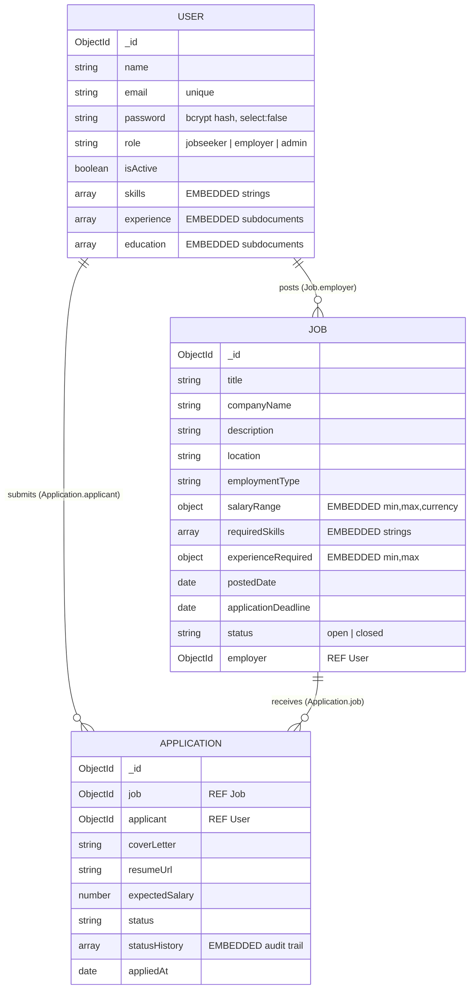

# Job Portal Backend API

A secure, role-based REST API for a job portal, built with **Node.js, Express, MongoDB and Mongoose**.

- **Job seekers** register, maintain a profile, browse jobs, apply, and track their applications.
- **Employers** create and manage their own job postings and review applications received for them.
- **Admins** manage users and job postings, and review platform-wide data.

This is a backend-only project — no frontend, payments or e-mail.

| Layer | Technology |
| --- | --- |
| Runtime / framework | Node.js, Express 4 |
| Database / ODM | MongoDB, Mongoose |
| Authentication | JWT stored in an httpOnly cookie |
| Password security | bcrypt (`bcryptjs`, 12 salt rounds) |
| Validation | Joi (requests) + Mongoose validators (data) |
| Hardening | helmet, CORS allow-list, rate limiting, body-size limit |
| API testing | Postman collection (97 requests, 280 assertions) |
| Configuration | Environment variables (`.env`) |

---

## Table of contents

1. [Quick start](#1-quick-start)
2. [Environment variables](#2-environment-variables)
3. [Project structure](#3-project-structure)
4. [Roles and permissions](#4-roles-and-permissions)
5. [API reference](#5-api-reference)
6. [Database design](#6-database-design)
7. [Security](#7-security)
8. [Postman testing](#8-postman-testing)
9. [MongoDB files](#9-mongodb-files)
10. [Requirement coverage](#10-requirement-coverage)
11. [Pushing to GitHub](#11-pushing-to-github)

---

## 1. Quick start

**Prerequisites:** Node.js 20+ and MongoDB (local install, Docker, or a free MongoDB Atlas cluster).

```bash
npm install

cp .env.example .env            # Windows (cmd):  copy .env.example .env

docker compose up -d

npm run seed

npm run dev
```

The API is now available at `http://localhost:5000`. Verify it with `GET http://localhost:5000/api/health`.

### Scripts

| Script | What it does |
| --- | --- |
| `npm run dev` | Start with nodemon (auto restart) |
| `npm start` | Start in normal mode |
| `npm run seed` | Create the admin plus a demo employer, job seeker, 3 jobs and 1 application (safe to re-run) |
| `npm run seed:admin` | Create only the admin account |
| `npm run seed:destroy` | Delete all data (blocked when `NODE_ENV=production`) |

### Demo accounts

| Role | Email | Password |
| --- | --- | --- |
| Admin | `admin@jobportal.com` (from `.env`) | `Admin@12345` (from `.env`) |
| Employer | `employer@demo.com` | `Password@123` |
| Job seeker | `seeker@demo.com` | `Password@123` |

> The public API cannot create admins — registering with `"role": "admin"` is rejected. Admin accounts exist only through the seed script.

---

## 2. Environment variables

Copy `.env.example` to `.env`. Never commit `.env`; it is already listed in `.gitignore`.

| Variable | Purpose | Example |
| --- | --- | --- |
| `NODE_ENV` | `development` or `production` (production means secure cookies and hidden error details) | `development` |
| `PORT` | HTTP port | `5000` |
| `MONGO_URI` | MongoDB connection string | `mongodb://127.0.0.1:27017/job_portal` |
| `JWT_SECRET` | Key used to sign tokens, minimum 16 characters | *(long random string)* |
| `JWT_EXPIRES_IN` | Token lifetime | `1d` |
| `COOKIE_EXPIRES_DAYS` | Cookie lifetime, keep equal to the token lifetime | `1` |
| `CLIENT_ORIGIN` | Browser origins allowed by CORS, comma separated | `http://localhost:3000` |
| `RATE_LIMIT_MAX` | Max requests per IP per 15 minutes across the API | `500` |
| `AUTH_RATE_LIMIT_MAX` | Max login or register attempts per IP per 15 minutes | `100` |
| `ADMIN_NAME`, `ADMIN_EMAIL`, `ADMIN_PASSWORD` | Admin account created by `npm run seed` | `admin@jobportal.com` |

Generate a secret with:

```bash
node -e "console.log(require('crypto').randomBytes(48).toString('hex'))"
```

The server refuses to start if `MONGO_URI` or `JWT_SECRET` is missing.

---

## 3. Project structure

```text
job-portal-backend/
├── server.js                     entry point: env check, DB connect, listen
├── src/
│   ├── app.js                    Express app: security middleware, routes, error handling
│   ├── constants.js              roles, employment types, job and application statuses
│   ├── config/
│   │   ├── env.js                loads .env and fails fast if secrets are missing
│   │   └── db.js                 Mongoose connection
│   ├── models/
│   │   ├── User.js               account and profile (embedded skills, experience, education)
│   │   ├── Job.js                job posting (embedded salary and experience) with employer ref
│   │   └── Application.js        job and applicant refs, embedded status history
│   ├── middleware/
│   │   ├── auth.js               protect: verifies the JWT from the httpOnly cookie
│   │   ├── role.js               authorize: role verification
│   │   ├── validate.js           Joi validation and ObjectId validation
│   │   └── errorHandler.js       turns every error into a JSON response
│   ├── validators/               Joi schemas (auth, user, job, application, admin)
│   ├── controllers/              business logic (auth, user, job, application, admin)
│   ├── routes/                   URL to middleware chain to controller
│   └── utils/                    ApiError, asyncHandler, token and cookie helpers
├── scripts/
│   └── seed.js                   creates the admin and demo data
├── database/
│   ├── mongosh-examples.js       the same queries written as raw MongoDB shell commands
│   └── sample-documents.json     what a user, job and application look like in MongoDB
├── postman/
│   └── JobPortal.postman_collection.json
├── docker-compose.yml            optional local MongoDB
├── .env.example
└── README.md
```

Request flow for a protected route such as `POST /api/jobs`:

```text
request
  → helmet / CORS / rate limit
  → JSON and cookie parsers
  → protect              verify JWT cookie, load user      401 / 403
  → authorize('employer')                                  403
  → validate(createJobSchema)                              400
  → controller           ownership checks, database work    403 / 404 / 409
  → JSON response        (any error goes to errorHandler)
```

---

## 4. Roles and permissions

| Action | Public | Job seeker | Employer | Admin |
| --- | :-: | :-: | :-: | :-: |
| Register / login / logout | yes | yes | yes | login only |
| Browse jobs, view a job | yes | yes | yes | yes |
| View and update own profile | — | yes | yes | yes |
| Apply for a job | — | yes | — | — |
| View own applications and their status | — | yes | — | — |
| Create a job | — | — | yes | — |
| Update or delete own jobs only | — | — | yes | — |
| View applications for own jobs only | — | — | yes | — |
| Update an application status (own jobs) | — | — | yes | — |
| Manage all users (view, activate, delete) | — | — | — | yes |
| View or remove any job, view all applications, stats | — | — | — | yes |

Ownership rules are enforced in the controllers: an employer touching another employer's job gets a **403**, and a job seeker reading someone else's application gets a **403**.

---

## 5. API reference

Base URL: `http://localhost:5000`. Request and response bodies are JSON. Authentication uses the `token` cookie set at login — no `Authorization` header is needed.

**Response shape**

```jsonc
{ "success": true, "message": "...", "data": { } }

{ "count": 10, "pagination": { "total": 42, "page": 1, "limit": 10, "pages": 5 } }

{ "success": false, "message": "Validation failed", "errors": [ { "field": "email", "message": "email must be a valid email" } ] }
```

**Status codes**

| Code | Meaning |
| --- | --- |
| 200 | OK |
| 201 | Created |
| 400 | Validation error, malformed id, or bad JSON |
| 401 | Not logged in, or a bad or expired token |
| 403 | Wrong role, not the owner, or a deactivated account |
| 404 | Not found |
| 409 | Duplicate email or duplicate application |
| 413 | Body too large |
| 429 | Rate limit exceeded |

### Auth

| Method | Endpoint | Access | Description |
| --- | --- | --- | --- |
| POST | `/api/auth/register` | Public | Register as `jobseeker` or `employer` |
| POST | `/api/auth/login` | Public | Log in; the JWT is set in an httpOnly cookie |
| POST | `/api/auth/logout` | Public | Clear the cookie |
| GET | `/api/auth/me` | Any user | Current user |

### Profile

| Method | Endpoint | Access | Description |
| --- | --- | --- | --- |
| GET | `/api/users/profile` | Any user | View own profile |
| PUT | `/api/users/profile` | Any user | Update `name`, `phone`, `headline`, `location`, `companyName`, `skills`, `experience`, `education` |

Email, role and password cannot be changed through the profile endpoint.

### Jobs

| Method | Endpoint | Access | Description |
| --- | --- | --- | --- |
| GET | `/api/jobs` | Public | Open jobs with a future deadline. Query: `search`, `location`, `employmentType`, `skills` (comma list), `minSalary`, `sort` (`newest`, `oldest`, `salary`), `page`, `limit` |
| GET | `/api/jobs/:id` | Public | A single job |
| GET | `/api/jobs/my` | Employer | All own jobs, any status. Query: `status`, `page`, `limit` |
| POST | `/api/jobs` | Employer | Create a job |
| PUT | `/api/jobs/:id` | Employer (owner) | Update a job; partial updates are allowed |
| DELETE | `/api/jobs/:id` | Employer (owner) | Delete a job and its applications |
| GET | `/api/jobs/:id/applications` | Employer (owner) | Applications received. Query: `status`, `page`, `limit` |
| POST | `/api/jobs/:id/apply` | Job seeker | Apply once per job; `coverLetter`, `resumeUrl`, `expectedSalary` are optional |

### Applications

| Method | Endpoint | Access | Description |
| --- | --- | --- | --- |
| GET | `/api/applications/my` | Job seeker | Own applications with their status |
| GET | `/api/applications/:id` | Applicant, owning employer, or admin | One application including its status history |
| PATCH | `/api/applications/:id/status` | Employer (owner of the job) | Body `{ "status": "shortlisted", "note": "..." }` |

Valid statuses: `applied`, `under_review`, `shortlisted`, `rejected`, `hired`.

### Admin

Every admin route requires authentication **and** the admin role.

| Method | Endpoint | Description |
| --- | --- | --- |
| GET | `/api/admin/users` | All users. Query: `role`, `isActive`, `search`, `page`, `limit` |
| GET | `/api/admin/users/:id` | One user with an activity summary |
| PATCH | `/api/admin/users/:id/status` | Body `{ "isActive": false }`; deactivated users cannot log in |
| DELETE | `/api/admin/users/:id` | Delete a user and everything they own |
| GET | `/api/admin/jobs` | All jobs, any status. Query: `status`, `search`, `page`, `limit` |
| GET | `/api/admin/jobs/:id` | One job with its application count |
| DELETE | `/api/admin/jobs/:id` | Remove a job and its applications |
| GET | `/api/admin/applications` | All applications. Query: `status`, `page`, `limit` |
| GET | `/api/admin/stats` | Platform totals and breakdowns by role and status |

### Example: register, log in, create a job

```bash
curl -X POST localhost:5000/api/auth/register \
  -H "Content-Type: application/json" \
  -d '{"name":"Asha","email":"asha@acme.com","password":"Str0ngPass1","role":"employer","companyName":"Acme"}'

curl -c jar.txt -X POST localhost:5000/api/auth/login \
  -H "Content-Type: application/json" \
  -d '{"email":"asha@acme.com","password":"Str0ngPass1"}'

curl -b jar.txt -X POST localhost:5000/api/jobs \
  -H "Content-Type: application/json" \
  -d '{
    "title":"Backend Developer",
    "companyName":"Acme",
    "description":"Build secure REST APIs with Node.js and MongoDB.",
    "location":"Hyderabad",
    "employmentType":"full-time",
    "salaryRange":{"min":600000,"max":1000000},
    "requiredSkills":["node.js","mongodb"],
    "experienceRequired":{"min":1,"max":3},
    "applicationDeadline":"2027-01-31"
  }'
```

`-c` saves the login cookie to a file and `-b` sends it back on the next request.

---

## 6. Database design

Three collections: `users`, `jobs` and `applications`.



### Embedded data

Data that belongs to exactly one parent and is read and written together with it.

| Where | Embedded data | Reason |
| --- | --- | --- |
| `User` | `skills`, `experience[]`, `education[]` | Part of one person's profile, always loaded and updated with it, no identity of their own, and small. One read returns the whole profile with no joins. |
| `Job` | `salaryRange`, `experienceRequired`, `requiredSkills` | They describe only that one job and are always displayed with it. |
| `Application` | `statusHistory[]` | An audit trail with no meaning outside its application that grows by only a few entries. |

### Referenced data

Data with its own identity and lifecycle, or that is shared or unbounded.

| Reference | Reason |
| --- | --- |
| `Job.employer → User` | An employer is a user with their own lifecycle who can own many jobs. Storing only the id avoids duplicating user data. `populate()` returns just `name` and `companyName`, never the employer's email. |
| `Application.job → Job`, `Application.applicant → User` | An application connects two independent entities. Applications are not embedded in `Job` because they are unbounded (documents would grow towards MongoDB's 16 MB limit), they are queried from two directions, and their status changes independently. |

### Integrity rules

- `users.email` has a unique index, so there are no duplicate accounts.
- `applications (job, applicant)` has a unique compound index, so a job seeker can apply to a job only once, even if two requests arrive at the same instant.
- Deleting a job removes its applications, and deleting a user removes their jobs and applications, so no orphan documents remain.
- Skills are lower-cased and de-duplicated by a Mongoose setter.

Example documents are in [`database/sample-documents.json`](database/sample-documents.json).

---

## 7. Security

| Requirement | How it is done |
| --- | --- |
| Hash passwords, never store plain text | bcrypt with 12 rounds in a `pre('save')` hook; the password field is `select: false` |
| JWT after login, stored in an httpOnly cookie | `httpOnly`, `sameSite=strict`, and `secure` in production; the token is never put in the JSON body |
| Authentication middleware | `protect` verifies the signature (HS256 only) and expiry, then reloads the user from MongoDB, so deleted or deactivated users are locked out immediately |
| Role verification middleware | `authorize(...roles)` on every role-specific route |
| No passwords or hashes in responses | `select: false` plus a `toJSON` transform that strips `password` and `__v` |
| Secrets in environment variables | `JWT_SECRET`, `MONGO_URI` and the admin credentials all come from `.env` |
| Validate input before storing | Joi on every body and query, then Mongoose validators; unknown fields are stripped |

Additional protections:

- Mass assignment is blocked — `role`, `isActive`, `employer` and `postedDate` cannot be set by clients.
- NoSQL injection is blocked — a payload such as `{"email": {"$gt": ""}}` fails Joi's type check.
- Search input is escaped before it is used in a regular expression.
- All `:id` parameters are validated as ObjectIds.
- Login returns one generic error, so accounts cannot be enumerated.
- helmet headers, a CORS allow-list, rate limiting and a 10 kb body limit are enabled.
- Admins cannot self-register, deactivate themselves, or delete themselves.

> If you later host a browser frontend on a different site than the API, cookies need `SameSite=None; Secure` over HTTPS. Change `sameSite` in `src/utils/token.js` and set `CLIENT_ORIGIN`.

---

## 8. Postman testing

File: [`postman/JobPortal.postman_collection.json`](postman/JobPortal.postman_collection.json) — 9 folders, 97 requests, 280 automated assertions.

**Setup**

1. Start MongoDB and the API, then run `npm run seed` once.
2. In Postman choose **Import** and select the collection file.
3. Open the collection, go to the **Variables** tab and set:
   - `jwtSecret` — the `JWT_SECRET` from your `.env` (used only by the *Expired token* request)
   - `adminEmail` and `adminPassword` — your seeded admin (the defaults already match `.env.example`)
   - `baseUrl` — `http://localhost:5000` (default)
4. Click **Run collection** and run all folders in order.

Order matters because the JWT lives in an httpOnly cookie that Postman's cookie jar stores and re-sends. Each folder starts by logging in as the role it needs, and later folders reuse ids such as `jobId` and `applicationId` saved by earlier ones. The run cleans up every user, job and application it creates and uses a fresh `runId` in each email, so it can be run repeatedly.

| Folder | Covers |
| --- | --- |
| 00 Health & Public | Public endpoints and unknown routes |
| 01 Auth: Register & Login | Registration and login, duplicate email, validation errors, blocked admin self-registration, wrong password, cookie flags |
| 02 No Auth & Invalid Token | Requests without authentication, invalid token, expired token, public routes |
| 03 Employer: Job CRUD | Employer access, create, read, update, delete, invalid input, bad ids |
| 04 Job Seeker | Job seeker access, profile with embedded data, filters and pagination, applying, duplicate apply, blocked employer and admin routes, role escalation attempt |
| 05 Employer: Applications & Ownership | Reviewing applications, status updates, attempts to modify another user's resources |
| 06 Job Seeker: Status & Privacy | Seeker sees own status and cannot read another seeker's application |
| 07 Admin | Admin-only routes, user status, blocked login for deactivated users, deleting jobs and users, stats, cascade deletes |
| 08 Logout & Cookie Removal | Logout clears the cookie and protected routes return 401 afterwards |

**Running from the command line**

```bash
npm install -g newman
newman run postman/JobPortal.postman_collection.json --env-var "jwtSecret=<your JWT_SECRET>"
```

---

## 9. MongoDB files

| File | Purpose |
| --- | --- |
| `src/config/db.js` | How the app connects: `mongoose.connect(process.env.MONGO_URI)` |
| `src/models/*.js` | Mongoose schemas, indexes and hooks |
| `scripts/seed.js` | Creates the admin and demo data through the same models |
| `database/mongosh-examples.js` | Raw MongoDB shell version of the API's queries: indexes, `find` on embedded data, `$lookup` joins, `$group` reports, and update examples |
| `database/sample-documents.json` | Example documents from each collection |
| `docker-compose.yml` | One-command local MongoDB |

Run the shell examples:

```bash
mongosh "mongodb://127.0.0.1:27017/job_portal" --file database/mongosh-examples.js
```

Everything in that file is read-only except the index creation, which is idempotent. The update examples at the end run only when `RUN_WRITE_EXAMPLES` is set to `true` at the top of the file.

You can also browse the data visually in MongoDB Compass with the same connection string.

---

## 10. Requirement coverage

| Brief section | Where it is implemented |
| --- | --- |
| 4. Job seeker features and rules | `auth`, `users`, public job list and detail, `jobs/:id/apply`, `applications/my`, `applications/:id`; duplicate apply blocked by a unique index; other users' applications return 403 |
| 5. Employer features and rules | `POST/GET/PUT/DELETE /api/jobs`, `/api/jobs/my`, `/api/jobs/:id/applications`, `PATCH /api/applications/:id/status`; ownership checked on every write |
| 6. Admin features | `/api/admin/*` behind `protect` and `authorize('admin')` |
| 7. Database design | `User`, `Job` and `Application`; references Job→Employer, Application→Job, Application→Job seeker; embedded skills, experience, education, salary and status history |
| 8. Authentication and security | See [Security](#7-security) |
| 9. Postman testing | See [Postman testing](#8-postman-testing) |
| 10. Submission | Source code, models, `.env.example`, Postman collection and this README |

Design decisions worth knowing:

- **Browsing jobs is public** (`GET /api/jobs` and `GET /api/jobs/:id`), which is how job boards normally work and gives the Postman suite real public requests. To require login for browsing, add `protect` to those two routes in `src/routes/job.routes.js`.
- **Application statuses** follow `applied → under_review → shortlisted / rejected / hired`. An employer may set any of them and every change is recorded in `statusHistory`.
- **Deadlines** are enforced: applying to a closed job, or applying after `applicationDeadline`, returns 400. Public listings hide such jobs automatically.

---

## 11. Pushing to GitHub

```bash
git init
git add .
git status            # confirm .env and node_modules are NOT listed
git commit -m "Job Portal backend API"
git branch -M main
git remote add origin https://github.com/<your-username>/job-portal-backend.git
git push -u origin main
```

`.gitignore` already excludes `node_modules/` and `.env`. Commit `.env.example` only.
